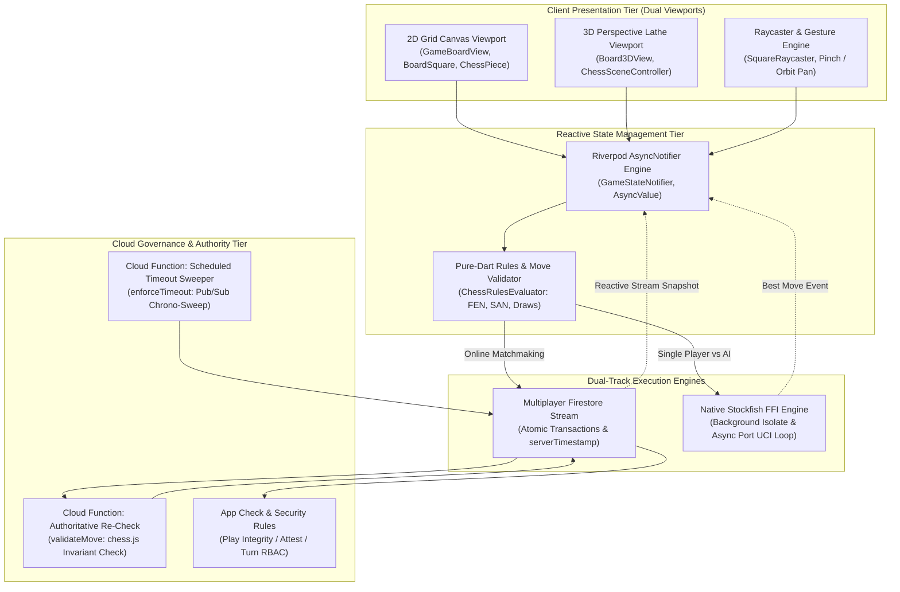
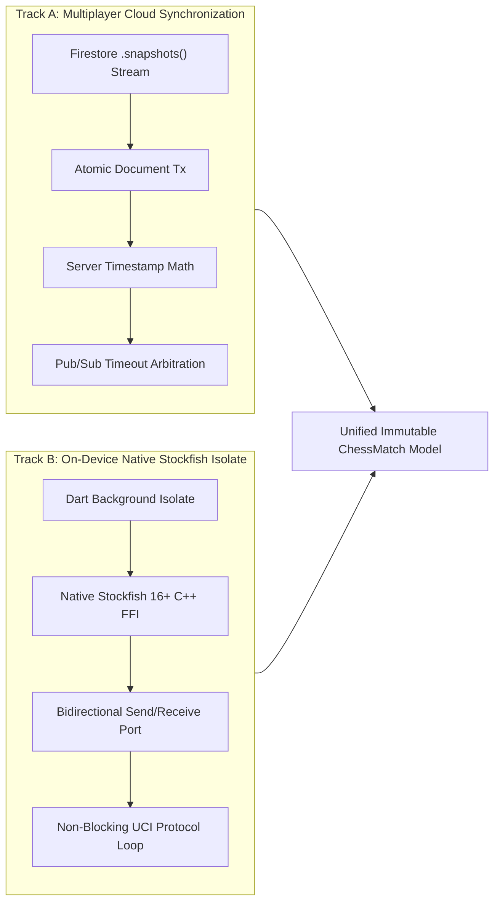
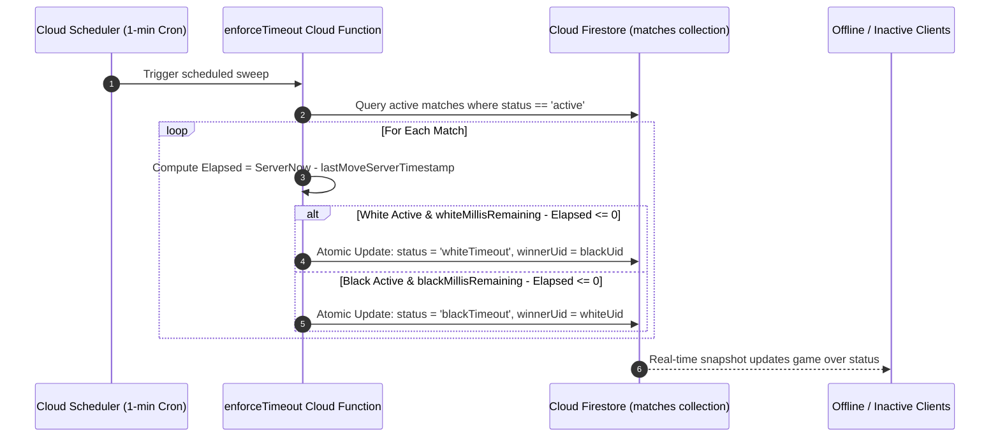

# Chessical // Technical Architecture Specification

This document details the systems design, data synchronization protocols, move mutation lifecycles, 3D rendering pipeline, mathematical raycasting hit-testing, background Stockfish FFI isolate architecture, and zero-exploit state reconciliation boundaries of the Chessical platform.

> **Architectural Non-Negotiables**: Move legality, check, checkmate, stalemate, threefold repetition, and four-case insufficient material are computed exclusively in pure Dart with zero LLM inference. Clocks are arbitrated strictly by server-calculated timestamps via atomic Firestore transactions. The 3D viewport is an immutable presentation consumer with continuous 2D fallback.

---

## Current Architecture Matrix

| Capability | Core Implementation | Architectural Invariant |
| :--- | :--- | :--- |
| **Move Validation** | `chess_rules_evaluator.dart` | 100% pure-Dart execution with exhaustive 4-case insufficient material and exact threefold FEN matching. |
| **State Machine** | `game_state_notifier.dart` | Riverpod `AsyncNotifier` consuming immutable `ChessMatch` snapshots with optimistic projection and rollback. |
| **Clock Synchronization** | `firestore_service.dart` | Server-side elapsed delta calculation ($T_{\text{elapsed}} = T_{\text{server}} - T_{\text{last}}$); local visual ticker snaps on snapshot. |
| **Single-Player Engine** | `stockfish_service.dart` | Native C++ Stockfish 16+ via FFI in a background Dart isolate with singleton lifecycle disposal. |
| **3D Real-Time Viewport** | `board_3d_view.dart` & `square_raycaster.dart` | CustomPainter perspective matrix projection with mathematical screen-to-square raycasting and lathe piece meshes. |
| **Multiplayer Synchronization**| `matches/{id}.snapshots()` | Reactive real-time Firestore document streams with exponential backoff resubscription. |
| **Replay & Concurrency Guard**| UUIDv4 `clientMoveId` | Dual-layer idempotency validation in both Firestore transactions and Cloud Functions. |
| **Authoritative Re-Check** | `validateMove.ts` (Cloud Functions) | Independent server-side re-validation against prior FEN state with automated write rollback on violation. |



---

## Table of Contents

- [1. Move Mutation Lifecycle & State Transitions](#1-move-mutation-lifecycle--state-transitions)
- [2. Dual-Track Hybrid Engine Topology](#2-dual-track-hybrid-engine-topology)
- [3. 3D Viewport, Raycasting & Geometry Pipeline](#3-3d-viewport-raycasting--geometry-pipeline)
- [4. Clock Arbitration & Autonomous Timeout Sweep](#4-clock-arbitration--autonomous-timeout-sweep)
- [5. Mathematical Rules & Terminal Invariants](#5-mathematical-rules--terminal-invariants)
- [6. State Management & Stream Reconciliation](#6-state-management--stream-reconciliation)
- [7. Error Recovery & Graceful Fallback Boundaries](#7-error-recovery--graceful-fallback-boundaries)

---

## 1. Move Mutation Lifecycle & State Transitions

### Detailed Execution Flow

Every move transition follows a strict optimistic-local-update $\to$ transaction-commit $\to$ server-re-validation $\to$ correction-if-rejected pipeline:

```text
[Touch Gesture (2D Drag or 3D Raycast)]
    │
    ▼
[GameBoardView._processMoveAttempt(from, to)]
    │
    ├─► 1. Local Pre-Flight Check:
    │     - Verify matching participant turn
    │     - Check in-flight lock (isMoveInFlight == false)
    │     - If pawn reaches promotion rank: prompt dialog for piece choice ('q', 'r', 'b', 'n')
    │
    ▼
[GameStateNotifier.executeMove(from, to, promotion)]
    │
    ├─► 2. Generate UUIDv4 clientMoveId
    │
    ├─► 3. Deterministic In-Memory Evaluation (Pure Dart chess):
    │     - If illegal move: throw IllegalMoveException (aborts without network write)
    │     - Compute new FEN, SAN, Check, Checkmate, Stalemate, HalfmoveClock, PositionHistory
    │
    ├─► 4. Optimistic UI Projection:
    │     - State temporarily updates local UI with predicted FEN
    │     - 3D Viewport initiates parabolic move animation arc
    │
    ▼
[FirestoreService.executeMoveTransaction(matchId, move)]
    │
    ├─► 5. Atomic Document Transaction:
    │     - Re-read match document inside transaction
    │     - Verify match.status == 'active'
    │     - Verify request.auth.uid matches existing activeTurn on document
    │     - Verify clientMoveId NOT in match.processedClientMoveIds (Idempotency Guard)
    │     - Compute remaining clock: Time_remaining - max(0, Now - LastMoveTimestamp)
    │     - Commit state write with FieldValue.serverTimestamp()
    │     - Append immutable record to /matches/{id}/moves/{moveNumber}
    │
    ▼
[Cloud Functions: validateMove.ts Trigger]
    │
    ├─► 6. Authoritative Server-Side Re-Validation:
    │     - Re-evaluates move using server-side chess engine against true prior FEN
    │     - If valid: confirms state and logs structured audit event
    │     - If mismatch detected: rolls back match state to prior FEN, suspends UID, logs security alert
    │
    ▼
[Reactive Stream Snapshot Sync]
    │
    └─► 7. All subscribed clients receive authoritative snapshot, snapping clocks and FEN
```

---

## 2. Dual-Track Hybrid Engine Topology

Chessical provides zero-network-latency local engine play and real-time multiplayer synchronization through two dedicated execution tracks:



### Native Stockfish Isolate Architecture

To prevent micro-stutters during deep engine searches (up to 20 plies), Stockfish runs in a dedicated background isolate:

1. **Singleton Concurrency Guard**: Only one active Stockfish engine isolate is permitted per device runtime to prevent CPU core saturation.
2. **UCI Command Serialization**: FEN and difficulty parameters are formatted as standard Universal Chess Interface (UCI) commands (`position fen <FEN>`, `go movetime <depth_time>`).
3. **Lifecycle Management**: The isolate instance is bound to the Flutter widget lifecycle, ensuring proper native thread termination upon navigation or hot reload.

---

## 3. 3D Viewport, Raycasting & Geometry Pipeline

```text
┌────────────────────────────────────────────────────────────────────────┐
│                        3D RENDERING PIPELINE                           │
│                                                                        │
│   Touch Position (X, Y)                                                │
│         │                                                              │
│         ▼                                                              │
│   Normalized Device Coordinates: u = (2x - W)/W, v = (H - 2y)/H        │
│         │                                                              │
│         ▼                                                              │
│   Camera Euler Transformation: R(pitch, yaw, zoom)                     │
│         │                                                              │
│         ▼                                                              │
│   Ray Construction: Ray Origin O + Unit Direction Vector D             │
│         │                                                              │
│         ▼                                                              │
│   Board Plane Intersection (Z = 0): t = -O_z / D_z                     │
│         │                                                              │
│         ▼                                                              │
│   Hit Point P_board = O + t*D ──► Algebraic Coordinate ('e4')          │
│         │                                                              │
│         ▼                                                              │
│   Depth-Sorted Lathe Mesh Rendering (Painter's Algorithm)              │
│         │                                                              │
│         ▼                                                              │
│   Smooth Parabolic Tween Animation Elevation Curve                     │
└────────────────────────────────────────────────────────────────────────┘
```

### Mathematical Formulation of Raycasting

1. **Camera Position Vector $\mathbf{C}$**:
   $$\mathbf{C}(\theta, \phi, R) = \begin{pmatrix} R \cdot \cos\theta \sin\phi \\ R \cdot \sin\theta \\ R \cdot \cos\theta \cos\phi \end{pmatrix}$$
   Where $\theta \in [0.2, 1.4]$ radians is camera pitch, $\phi \in [-\pi, \pi]$ is yaw, and $R$ is camera orbit distance.

2. **Ray Direction Vector $\mathbf{D}$**:
   $$\mathbf{D} = \text{Normalize}\left( u \cdot \mathbf{U} + v \cdot \mathbf{V} + f \cdot \mathbf{W} \right)$$
   Where $\mathbf{U}, \mathbf{V}, \mathbf{W}$ are camera orthonormal basis vectors and $f$ is focal length.

3. **Board Plane Collision**:
   The board lies on the horizontal plane $Z = 0$. The ray intersection parameter $t$ satisfies:
   $$\mathbf{P}_z = \mathbf{O}_z + t \cdot \mathbf{D}_z = 0 \implies t = -\frac{\mathbf{O}_z}{\mathbf{D}_z}$$
   $$\mathbf{P}_{\text{board}} = \mathbf{O} + t \cdot \mathbf{D} = \begin{pmatrix} x_b \\ y_b \\ 0 \end{pmatrix}$$

4. **Coordinate Mapping**:
   $$\text{File} = \left\lfloor \frac{x_b + 4 \cdot S}{S} \right\rfloor \in [0, 7], \qquad \text{Rank} = \left\lfloor \frac{y_b + 4 \cdot S}{S} \right\rfloor \in [0, 7]$$
   Mapped to algebraic notation: $\text{Square} = \text{String.fromCharCode}(97 + \text{File}) + (1 + \text{Rank})$.

---

## 4. Clock Arbitration & Autonomous Timeout Sweep

### Tamper-Proof Clock Invariant

The client device clock is strictly treated as untrusted. Elapsed time for each move is computed server-side:

$$T_{\text{elapsed}} = \max\left(0,\; T_{\text{server}}^{(k)} - T_{\text{server}}^{(k-1)}\right)$$

$$\text{TimeLeft}_{\text{active}} = \max\left(0,\; \text{TimeLeft}_{\text{prior}} - T_{\text{elapsed}}\right)$$

### Scheduled Pub/Sub Timeout Sweeper (`enforceTimeout.ts`)



---

## 5. Mathematical Rules & Terminal Invariants

### 1. Four-Case Insufficient Material Matrix

| Case | Pieces Remaining | Material Distribution | Terminal State |
| :--- | :--- | :--- | :--- |
| **Case 1** | $K \text{ vs } K$ | White: $\{K\}$, Black: $\{K\}$ | Immediate Draw |
| **Case 2** | $K+B \text{ vs } K$ | White: $\{K, B\}$, Black: $\{K\}$ (or vice versa) | Immediate Draw |
| **Case 3** | $K+N \text{ vs } K$ | White: $\{K, N\}$, Black: $\{K\}$ (or vice versa) | Immediate Draw |
| **Case 4a**| $K+B \text{ vs } K+B$ | Both bishops occupy squares of the **same color** | Immediate Draw |
| **Case 4b**| $K+B \text{ vs } K+B$ | Bishops occupy squares of **opposite colors** | **Active (Checkmate possible)** |

### 2. Exact FEN Threefold Repetition

$$\text{StateRecord} = \text{PiecePlacement} \parallel \text{SideToMove} \parallel \text{CastlingRights} \parallel \text{EnPassantSquare}$$

$$\text{IsThreefold} = \left( \sum_{i=1}^{M} \mathbb{I}\left(\text{StateRecord}_i = \text{StateRecord}_{\text{current}}\right) \ge 3 \right)$$

---

## 6. State Management & Stream Reconciliation

```text
┌────────────────────────────────────────────────────────────────────────┐
│                   RIVERPOD STATE MACHINE HIERARCHY                     │
│                                                                        │
│   gameStateNotifierProvider (AsyncNotifierProvider<GameStateNotifier>) │
│       ├── state: AsyncValue<ChessMatch>                                │
│       ├── isMoveInFlightProvider: NotifierProvider<bool>               │
│       ├── isReconnectingProvider: NotifierProvider<bool>               │
│       └── activeMatchId: String?                                       │
│                                                                        │
│   Stream Resubscription with Exponential Backoff:                     │
│       - Attempt 1: 500ms                                               │
│       - Attempt 2: 1000ms                                              │
│       - Attempt 3: 2000ms                                              │
│       - Attempt 4: 4000ms (Cap: 8000ms)                                │
└────────────────────────────────────────────────────────────────────────┘
```

---

## 7. Error Recovery & Graceful Fallback Boundaries

1. **3D Initialization / Shader Failure**: If canvas 3D projection triggers a `RenderInitException` or GPU context loss, `GameBoardView` catches the exception and flips `_renderMode = BoardRenderMode.twoD`, rendering the standard 2D canvas without disrupting the active match.
2. **Network Partition During Move Write**: If an in-flight transaction fails due to connectivity loss, the local optimistic FEN is rolled back to the last verified snapshot and the user is shown a non-blocking retry indicator.
3. **Stale State Resolution**: If an opponent's move arrives concurrently with a local move submission, the transaction fails at the `activeTurn` check, triggering an automatic resync to the opponent's authoritative board state.
