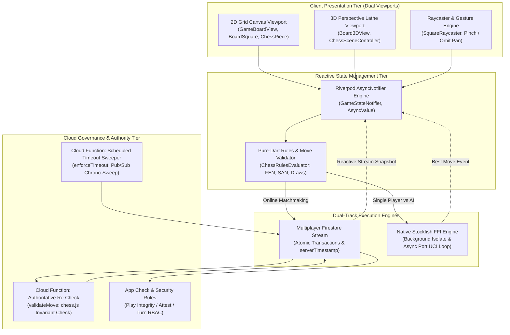
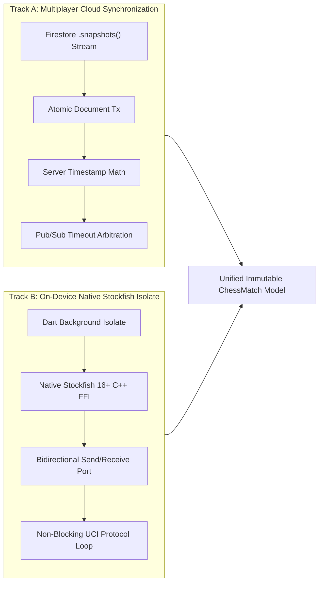
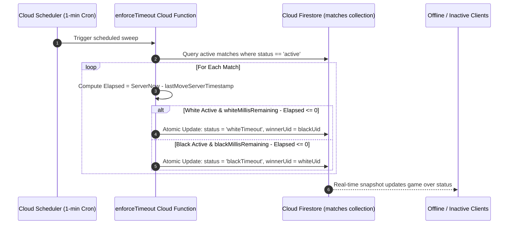

# Chessical // Technical Architecture Specification

This document details the systems design, data synchronization protocols, move mutation lifecycles, 3D rendering pipeline, mathematical raycasting hit-testing, background Stockfish FFI isolate architecture, and zero-exploit state reconciliation boundaries of the Chessical platform.

> **Architectural Non-Negotiables**: Move legality, check, checkmate, stalemate, threefold repetition, and four-case insufficient material are computed exclusively in pure Dart with zero LLM inference. Clocks are arbitrated strictly by server-calculated timestamps via atomic Firestore transactions. The 3D viewport is an immutable presentation consumer with continuous 2D fallback.

---

## Current Architecture Matrix

| Capability | Core Implementation | Architectural Invariant |
| :--- | :--- | :--- |
| **Move Validation** | `chess_rules_evaluator.dart` | 100% pure-Dart execution with exhaustive 4-case insufficient material and exact threefold FEN matching. |
| **State Machine** | `game_state_notifier.dart` | Riverpod `AsyncNotifier` consuming immutable `ChessMatch` snapshots with optimistic projection and rollback. |
| **Clock Synchronization** | `firestore_service.dart` | Server-side elapsed delta calculation ($T_{\text{elapsed}} = T_{\text{server}} - T_{\text{last}}$); local visual ticker snaps on snapshot. |
| **Single-Player Engine** | `stockfish_service.dart` | Native C++ Stockfish 16+ via FFI in a background Dart isolate with singleton lifecycle disposal. |
| **3D Real-Time Viewport** | `board_3d_view.dart` & `square_raycaster.dart` | CustomPainter perspective matrix projection with mathematical screen-to-square raycasting and lathe piece meshes. |
| **Multiplayer Synchronization**| `matches/{id}.snapshots()` | Reactive real-time Firestore document streams with exponential backoff resubscription. |
| **Replay & Concurrency Guard**| UUIDv4 `clientMoveId` | Dual-layer idempotency validation in both Firestore transactions and Cloud Functions. |
| **Authoritative Re-Check** | `validateMove.ts` (Cloud Functions) | Independent server-side re-validation against prior FEN state with automated write rollback on violation. |



---

## Table of Contents

- [1. Move Mutation Lifecycle & State Transitions](#1-move-mutation-lifecycle--state-transitions)
- [2. Dual-Track Hybrid Engine Topology](#2-dual-track-hybrid-engine-topology)
- [3. 3D Viewport, Raycasting & Geometry Pipeline](#3-3d-viewport-raycasting--geometry-pipeline)
- [4. Clock Arbitration & Autonomous Timeout Sweep](#4-clock-arbitration--autonomous-timeout-sweep)
- [5. Mathematical Rules & Terminal Invariants](#5-mathematical-rules--terminal-invariants)
- [6. State Management & Stream Reconciliation](#6-state-management--stream-reconciliation)
- [7. Error Recovery & Graceful Fallback Boundaries](#7-error-recovery--graceful-fallback-boundaries)

---

## 1. Move Mutation Lifecycle & State Transitions

### Detailed Execution Flow

Every move transition follows a strict optimistic-local-update $\to$ transaction-commit $\to$ server-re-validation $\to$ correction-if-rejected pipeline:

```text
[Touch Gesture (2D Drag or 3D Raycast)]
    │
    ▼
[GameBoardView._processMoveAttempt(from, to)]
    │
    ├─► 1. Local Pre-Flight Check:
    │     - Verify matching participant turn
    │     - Check in-flight lock (isMoveInFlight == false)
    │     - If pawn reaches promotion rank: prompt dialog for piece choice ('q', 'r', 'b', 'n')
    │
    ▼
[GameStateNotifier.executeMove(from, to, promotion)]
    │
    ├─► 2. Generate UUIDv4 clientMoveId
    │
    ├─► 3. Deterministic In-Memory Evaluation (Pure Dart chess):
    │     - If illegal move: throw IllegalMoveException (aborts without network write)
    │     - Compute new FEN, SAN, Check, Checkmate, Stalemate, HalfmoveClock, PositionHistory
    │
    ├─► 4. Optimistic UI Projection:
    │     - State temporarily updates local UI with predicted FEN
    │     - 3D Viewport initiates parabolic move animation arc
    │
    ▼
[FirestoreService.executeMoveTransaction(matchId, move)]
    │
    ├─► 5. Atomic Document Transaction:
    │     - Re-read match document inside transaction
    │     - Verify match.status == 'active'
    │     - Verify request.auth.uid matches existing activeTurn on document
    │     - Verify clientMoveId NOT in match.processedClientMoveIds (Idempotency Guard)
    │     - Compute remaining clock: Time_remaining - max(0, Now - LastMoveTimestamp)
    │     - Commit state write with FieldValue.serverTimestamp()
    │     - Append immutable record to /matches/{id}/moves/{moveNumber}
    │
    ▼
[Cloud Functions: validateMove.ts Trigger]
    │
    ├─► 6. Authoritative Server-Side Re-Validation:
    │     - Re-evaluates move using server-side chess engine against true prior FEN
    │     - If valid: confirms state and logs structured audit event
    │     - If mismatch detected: rolls back match state to prior FEN, suspends UID, logs security alert
    │
    ▼
[Reactive Stream Snapshot Sync]
    │
    └─► 7. All subscribed clients receive authoritative snapshot, snapping clocks and FEN
```

---

## 2. Dual-Track Hybrid Engine Topology

Chessical provides zero-network-latency local engine play and real-time multiplayer synchronization through two dedicated execution tracks:



### The Two-Channel Separation Policy

To support ephemeral multiplayer rendering (such as live opponent drag preview) without compromising the transactional integrity of the match, the architecture enforces a strict two-channel separation:

#### Channel 1: Authoritative Move State (Firestore)
- **Transport**: Cloud Firestore `matches/{id}` documents and `moves` subcollections.
- **Rules**: Mutated exclusively via `executeMoveTransaction()`. Writes are validated, rate-limited, and arbitrate clock state.
- **Impact**: Changes `currentFen`, `activeTurn`, `clocks`, and `MatchStatus`. This is the ONLY channel that has authority over the game.

#### Channel 2: Ephemeral Drag-Position Stream (Firebase Realtime Database)
- **Transport**: Firebase Realtime Database at `liveDrag/{matchId}`.
- **Rules**: High-frequency (~20Hz), unvalidated, last-write-wins data. Exists solely to broadcast the dragging player's pointer position.
- **Impact**: Purely visual. Drives "ghost piece" rendering on the observing client. No security rule, Cloud Function, or client code may *ever* read this channel as input to move validation, anti-cheat heurists, or clock calculation.
- **Why RTDB?**: Firestore's document-write pricing and transaction model are the wrong fit for 15-20 writes/sec per client. RTDB provides the required low latency without the massive document-write costs, keeping the ephemeral data logically and physically disjoint from the authoritative data.

#### Channel 3: Push Notification Re-Engagement (FCM)
- **Transport**: Firebase Cloud Messaging, triggered by Cloud Functions (`sendTurnNotification.ts`, `sendMatchEventNotification.ts`).
- **Rules**: Only triggered when authoritative state changes (e.g., activeTurn flips) AND the target player is not actively viewing the match (presence suppression via RTDB).
- **Impact**: Strictly an attention/re-engagement mechanism. Push notifications NEVER carry authoritative game state. Upon tapping a notification, the app deep-links to the match and forces a resync via Channel 1.

### Native Stockfish Isolate Architecture

To prevent micro-stutters during deep engine searches (up to 20 plies), Stockfish runs in a dedicated background isolate:

1. **Singleton Concurrency Guard**: Only one active Stockfish engine isolate is permitted per device runtime to prevent CPU core saturation.
2. **UCI Command Serialization**: FEN and difficulty parameters are formatted as standard Universal Chess Interface (UCI) commands (`position fen <FEN>`, `go movetime <depth_time>`).
3. **Lifecycle Management**: The isolate instance is bound to the Flutter widget lifecycle, ensuring proper native thread termination upon navigation or hot reload.

---

## 3. 3D Viewport, Raycasting & Geometry Pipeline

```text
┌────────────────────────────────────────────────────────────────────────┐
│                        3D RENDERING PIPELINE                           │
│                                                                        │
│   Touch Position (X, Y)                                                │
│         │                                                              │
│         ▼                                                              │
│   Normalized Device Coordinates: u = (2x - W)/W, v = (H - 2y)/H        │
│         │                                                              │
│         ▼                                                              │
│   Camera Euler Transformation: R(pitch, yaw, zoom)                     │
│         │                                                              │
│         ▼                                                              │
│   Ray Construction: Ray Origin O + Unit Direction Vector D             │
│         │                                                              │
│         ▼                                                              │
│   Board Plane Intersection (Z = 0): t = -O_z / D_z                     │
│         │                                                              │
│         ▼                                                              │
│   Hit Point P_board = O + t*D ──► Algebraic Coordinate ('e4')          │
│         │                                                              │
│         ▼                                                              │
│   Depth-Sorted Lathe Mesh Rendering (Painter's Algorithm)              │
│         │                                                              │
│         ▼                                                              │
│   Smooth Parabolic Tween Animation Elevation Curve                     │
└────────────────────────────────────────────────────────────────────────┘
```

### Mathematical Formulation of Raycasting

1. **Camera Position Vector $\mathbf{C}$**:
   $$
   \mathbf{C}(\theta, \phi, R) = \begin{pmatrix} R \cdot \cos\theta \sin\phi \\\\ R \cdot \sin\theta \\\\ R \cdot \cos\theta \cos\phi \end{pmatrix}
   $$
   Where $\theta \in [0.2, 1.4]$ radians is camera pitch, $\phi \in [-\pi, \pi]$ is yaw, and $R$ is camera orbit distance.

2. **Ray Direction Vector $\mathbf{D}$**:
   $$
   \mathbf{D} = \text{Normalize}\left( u \cdot \mathbf{U} + v \cdot \mathbf{V} + f \cdot \mathbf{W} \right)
   $$
   Where $\mathbf{U}, \mathbf{V}, \mathbf{W}$ are camera orthonormal basis vectors and $f$ is focal length.

3. **Board Plane Collision**:
   The board lies on the horizontal plane $Z = 0$. The ray intersection parameter $t$ satisfies:
   $$
   \mathbf{P}_z = \mathbf{O}_z + t \cdot \mathbf{D}_z = 0 \implies t = -\frac{\mathbf{O}_z}{\mathbf{D}_z}
   $$
   $$
   \mathbf{P}_{\text{board}} = \mathbf{O} + t \cdot \mathbf{D} = \begin{pmatrix} x_b \\\\ y_b \\\\ 0 \end{pmatrix}
   $$

4. **Coordinate Mapping**:
   $$
   \text{File} = \left\lfloor \frac{x_b + 4 \cdot S}{S} \right\rfloor \in [0, 7], \qquad \text{Rank} = \left\lfloor \frac{y_b + 4 \cdot S}{S} \right\rfloor \in [0, 7]
   $$
   Mapped to algebraic notation: $\text{Square} = \text{String.fromCharCode}(97 + \text{File}) + (1 + \text{Rank})$.

---

## 4. Clock Arbitration & Autonomous Timeout Sweep

### Tamper-Proof Clock Invariant

The client device clock is strictly treated as untrusted. Elapsed time for each move is computed server-side:

$$T_{\text{elapsed}} = \max\left(0,\; T_{\text{server}}^{(k)} - T_{\text{server}}^{(k-1)}\right)$$

$$\text{TimeLeft}_{\text{active}} = \max\left(0,\; \text{TimeLeft}_{\text{prior}} - T_{\text{elapsed}}\right)$$

### Scheduled Pub/Sub Timeout Sweeper (`enforceTimeout.ts`)



---

## 5. Mathematical Rules & Terminal Invariants

### 1. Four-Case Insufficient Material Matrix

| Case | Pieces Remaining | Material Distribution | Terminal State |
| :--- | :--- | :--- | :--- |
| **Case 1** | $K \text{ vs } K$ | White: $\{K\}$, Black: $\{K\}$ | Immediate Draw |
| **Case 2** | $K+B \text{ vs } K$ | White: $\{K, B\}$, Black: $\{K\}$ (or vice versa) | Immediate Draw |
| **Case 3** | $K+N \text{ vs } K$ | White: $\{K, N\}$, Black: $\{K\}$ (or vice versa) | Immediate Draw |
| **Case 4a**| $K+B \text{ vs } K+B$ | Both bishops occupy squares of the **same color** | Immediate Draw |
| **Case 4b**| $K+B \text{ vs } K+B$ | Bishops occupy squares of **opposite colors** | **Active (Checkmate possible)** |

### 2. Exact FEN Threefold Repetition

$$\text{StateRecord} = \text{PiecePlacement} \parallel \text{SideToMove} \parallel \text{CastlingRights} \parallel \text{EnPassantSquare}$$

$$\text{IsThreefold} = \left( \sum_{i=1}^{M} \mathbb{I}\left(\text{StateRecord}_i = \text{StateRecord}_{\text{current}}\right) \ge 3 \right)$$

### 3. Draw Condition Resolution Strategy

Unlike FIDE over-the-board play where certain draws are "claimable" by a player and others are "automatic", digital interfaces benefit from deterministic auto-resolution to avoid complex UI states (e.g., offering a "Claim Draw" button).
- **Threefold Repetition & 50-Move Rule**: These are strictly auto-resolved and immediately terminate the match in a draw the moment the claimable threshold is reached. No player action is required.
- **Fivefold Repetition & 75-Move Rule**: Because the app automatically resolves the match at 3 repetitions and 50 moves, the 5-fold and 75-move thresholds are intrinsically never reached and are thus not separately enforced.
- **Insufficient Material & Dead Positions**: Only the explicitly listed 4 cases above are enforced, relying strictly on the `chess` package's `insufficient_material()` checks. Complex dead positions (e.g., locked pawn chains) or K+N+N vs K are NOT classified as insufficient material by the package and remain active.

### 4. Untimed Match Abandonment
Untimed matches are structurally exempt from the Cron timeout sweeper. However, to prevent indefinitely stalled matches, the waiting player (whose turn it is NOT) gains the ability to manually claim a win via abandonment. This is verified server-side against `lastMoveServerTimestamp` (which is tracked for all matches specifically for this purpose). If `DateTime.now() - lastMoveServerTimestamp >= 24 hours`, the claim succeeds and updates the match status to `abandoned`.

---

## 6. State Management & Stream Reconciliation

```text
┌────────────────────────────────────────────────────────────────────────┐
│                   RIVERPOD STATE MACHINE HIERARCHY                     │
│                                                                        │
│   gameStateNotifierProvider (AsyncNotifierProvider<GameStateNotifier>) │
│       ├── state: AsyncValue<ChessMatch>                                │
│       ├── isMoveInFlightProvider: NotifierProvider<bool>               │
│       ├── isReconnectingProvider: NotifierProvider<bool>               │
│       └── activeMatchId: String?                                       │
│                                                                        │
│   Stream Resubscription with Exponential Backoff:                     │
│       - Attempt 1: 500ms                                               │
│       - Attempt 2: 1000ms                                              │
│       - Attempt 3: 2000ms                                              │
│       - Attempt 4: 4000ms (Cap: 8000ms)                                │
└────────────────────────────────────────────────────────────────────────┘
```

---

## 7. Error Recovery & Graceful Fallback Boundaries

1. **3D Initialization / Shader Failure**: If canvas 3D projection triggers a `RenderInitException` or GPU context loss, `GameBoardView` catches the exception and flips `_renderMode = BoardRenderMode.twoD`, rendering the standard 2D canvas without disrupting the active match.
2. **Network Partition During Move Write**: If an in-flight transaction fails due to connectivity loss, the local optimistic FEN is rolled back to the last verified snapshot and the user is shown a non-blocking retry indicator.
3. **Stale State Resolution**: If an opponent's move arrives concurrently with a local move submission, the transaction fails at the `activeTurn` check, triggering an automatic resync to the opponent's authoritative board state.

---

## 8. Liquid Glass Visual System

### 8.1 Design Philosophy

Chessical implements Apple's **Liquid Glass** visual language with a strict **Black & White, Zero-Icon** design policy:

| Design Axis | Rule |
| :--- | :--- |
| **Color palette** | Strictly 9 greyscale hex steps: `#000000` → `#0A0A0A` → `#1A1A1A` → `#333333` → `#666666` → `#999999` → `#E0E0E0` → `#FAFAFA` → `#FFFFFF`. Zero saturated chroma. |
| **Icons** | All icon fonts (`Icons.*`, `CupertinoIcons.*`, SVG glyphs) replaced with explicit textual labels (`Sound`, `2D`, `3D`, `Flip`, `Menu`, `Chat`, `×`) and geometric indicators (filled / outlined circles, border rings). |
| **Typography** | Display: `Cinzel` (classical serif, titles and match outcomes). UI / Body: `Inter` (humanist sans, clocks, SAN notation, buttons). All clock text uses tabular figures. |

### 8.2 Dual-Path Architecture

```
UI Chrome Surface (Clocks, History Panel, Dialogs, Quick Chat Modal)
        │
        ▼
 Platform & Capability Check
   ┌────────────────────────────────────────────┐
   │  iOS 26+ SDK + Bridge Available            │
   │  ──────────────────────────────────        │
   │  PATH A: Native iOS Liquid Glass Bridge    │
   │  • UiKitView hosts SwiftUI .glassEffect()  │
   │  • True hardware pixel refraction (Metal)  │
   │  • Gyro-reactive specular highlights       │
   │  • Reads: UIAccessibility.isReduce{Motion, │
   │    Transparency}Enabled before rendering   │
   └────────────────────────────────────────────┘
   ┌────────────────────────────────────────────┐
   │  Android, Windows, Web, or iOS fallback    │
   │  ──────────────────────────────────────    │
   │  PATH B: Flutter-Native Approximation      │
   │  • BackdropFilter(ImageFilter.blur(σ=24))  │
   │  • 8%-18% semi-transparent wash, no grads  │
   │  • 1 px hairline at 12% opacity            │
   │  • sensors_plus accelerometer → specular   │
   │    streak parallax shift (±6 px)           │
   │  • Spring-overshoot spring curve           │
   └────────────────────────────────────────────┘
        │
        ▼
 Accessibility Override
   • MediaQuery.disableAnimations / highContrast
     → Flat opaque BoardThemes.surfaceCard surface
   • UIAccessibility.isReduceTransparencyEnabled
     → Opaque UIColor without blur or specular
```

### 8.3 Key Files

| File | Role |
| :--- | :--- |
| [`lib/core/theme/board_themes.dart`](lib/core/theme/board_themes.dart) | 9-step greyscale palette tokens + backwards-compat aliases |
| [`lib/core/theme/app_typography.dart`](lib/core/theme/app_typography.dart) | Cinzel + Inter type scale with tabular clock figures |
| [`lib/core/theme/liquid_glass.dart`](lib/core/theme/liquid_glass.dart) | `LiquidGlassContainer` (Path B), `queryLiquidGlassBridge()` (Path A), `showLiquidGlassModal()` |
| [`ios/Runner/LiquidGlassView.swift`](ios/Runner/LiquidGlassView.swift) | Native SwiftUI `.glassEffect()` platform view + iOS 13 UIVisualEffectView fallback |
| [`ios/Runner/AppDelegate.swift`](ios/Runner/AppDelegate.swift) | Registers `LiquidGlassViewFactory` + `enterprise_chess/liquid_glass` accessibility method channel |

### 8.4 Surface Inventory

All glass surfaces in the app use `LiquidGlassContainer` with these parameters:

| Surface | σBlur | Border Radius | Notes |
| :--- | :---: | :---: | :--- |
| Player Clock Bar | 24 | 16 px | Wrapped in game_board_view.dart |
| Grade Engine Cards | 24 | 14 px | Per-card in home_screen.dart |
| Quick Chat Modal | 24 | 24 px top | Bottom sheet |
| Profile header | 24 | 20 px | Default |

### 8.5 Accessibility Compliance

- **Reduce Transparency (iOS)**: Queried via Path A bridge → `flat surfaceCard` fallback.
- **Reduce Motion (iOS + Flutter)**: `MediaQuery.disableAnimations(context)` → disables specular animation and `AnimatedContainer` transitions.
- **High Contrast (Flutter)**: `MediaQuery.highContrastOf(context)` → disables blur, renders solid surface.
- All text elements meet WCAG 2.1 AA contrast (≥4.5:1) against the `#0A0A0A` scaffold background.

---

## 9. Build Order & Implementation Phases

**Stage 6 Additions:**
  6b. **Live drag preview** -> Verify on two simulated/real clients: dragging player sees smooth local drag, observing player sees the ghost piece track in real time, illegal release snaps back with no ghost artifact left behind, legal release transitions cleanly from ghost to the real committed-move animation, and a simulated mid-drag disconnect clears the ghost within the defined 500ms staleness window on the observer's client.

**Stage 7 Additions:**
  7b. **Push notifications** -> Real-time sync vs push notifications division. Verify Cloud Functions send FCM messages to inactive players on turn change or match events. Verify foreground suppression via RTDB presence marker prevents duplicate notifications when the user is actively viewing the match.
