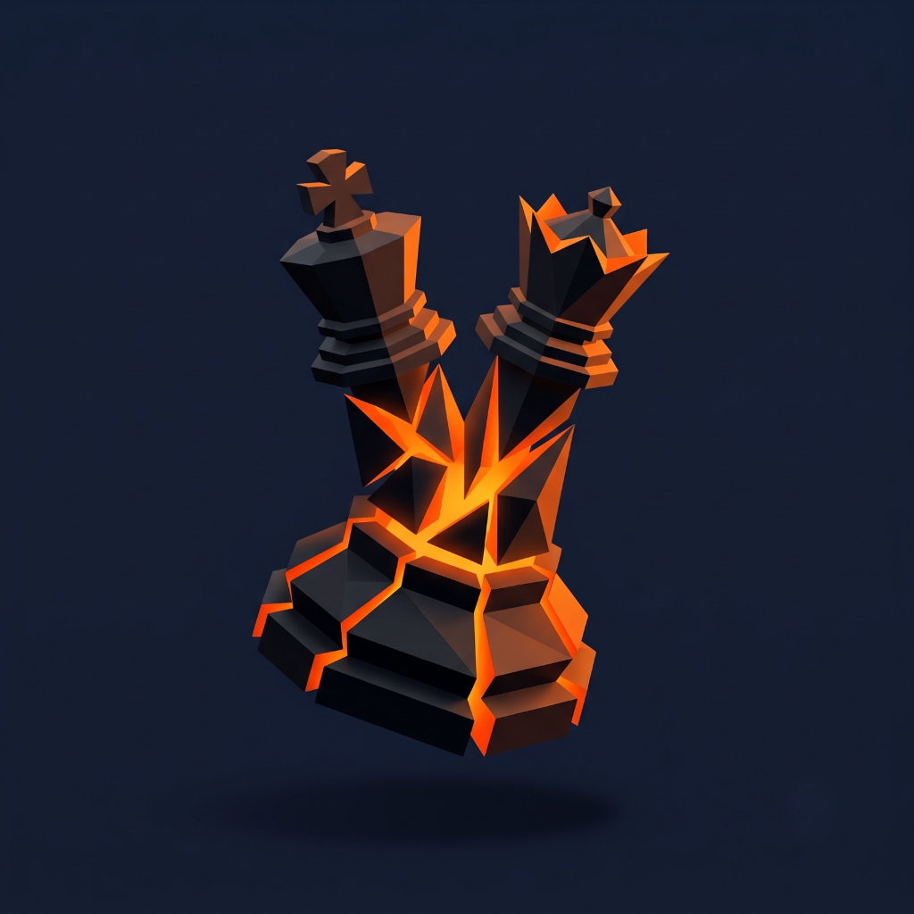
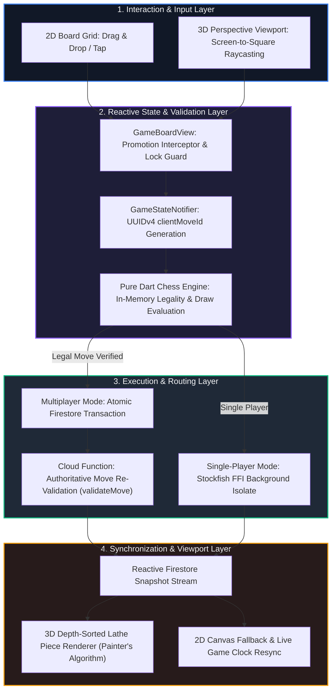

<div align="center">



# Chessical ♚ // Grandmaster 3D & Real-Time Engine

## Zero-Exploit Reactive Chess Platform with Pure-Dart Rules Engine, On-Device Stockfish FFI, Custom 3D Raycasting Viewport, and Authoritative Cloud Synchronization

[](#multi-platform-client-architecture)
[](#state-management--riverpod-architecture)
[](#mathematical-formulation--rules-engine)
[](#3d-rendering-pipeline--raycasting-mathematics)
[](#security-architecture--threat-model)
[](#backend--cloud-functions-architecture)

</div>

---

**Grandmaster-grade chess with mathematical precision, zero-exploit security, and real-time 3D rendering.**

Chessical combines deterministic client-side chess evaluation with authoritative server-side validation, on-device native Stockfish engine execution via background Dart isolates, and a perspective 3D viewport driven by mathematical screen-to-square raycasting.

```text
GESTURE / RAYCAST → IMMUTABLE RIVERPOD STATE → PURE DART ENGINE → ATOMIC FIRESTORE / STOCKFISH → 3D VIEWPORT & RECONCILIATION
```

Every move is validated in pure Dart; every turn is cryptographically protected against replay attacks with UUIDv4 tokens; every clock is arbitrated server-side with tamper-proof timestamps; and every piece is rendered with depth-sorted 3D geometry and graceful 2D fallback.

---

## Table of Contents

- [Executive Summary & Problem Statement](#executive-summary--problem-statement)
- [System Architecture & Move Mutation Pipeline](#system-architecture--move-mutation-pipeline)
- [Product Surface & Core Capabilities](#product-surface--core-capabilities)
- [Comparative Positioning & Industry Benchmarks](#comparative-positioning--industry-benchmarks)
- [Mathematical Formulation & Rules Engine](#mathematical-formulation--rules-engine)
- [3D Rendering Pipeline & Raycasting Mathematics](#3d-rendering-pipeline--raycasting-mathematics)
- [Security Architecture & Threat Model](#security-architecture--threat-model)
- [Hybrid Topology: Multiplayer Streams & Stockfish FFI](#hybrid-topology-multiplayer-streams--stockfish-ffi)
- [State Management & Riverpod Architecture](#state-management--riverpod-architecture)
- [Backend & Cloud Functions Architecture](#backend--cloud-functions-architecture)
- [Multi-Platform Client Architecture](#multi-platform-client-architecture)
- [Complete Technology Stack](#complete-technology-stack)
- [Project Structure & Directory Tree](#project-structure--directory-tree)
- [Getting Started & Local Development](#getting-started--local-development)
- [Testing & Verification Gate](#testing--verification-gate)
- [Documentation Index](#documentation-index)
- [License](#license)

---

## Executive Summary & Problem Statement

Modern mobile chess platforms suffer from critical architectural compromises:

1. **Client-Clock Vulnerabilities**: Most mobile chess clients rely on local device clocks or naive client-reported time deltas, exposing competitive matches to device clock manipulation and artificial timeout exploitation.
2. **Replay & Concurrency Desynchronization**: Near-simultaneous move transmissions often cause state drift, double-move applications, or lost turns over unstable mobile networks.
3. **Engine Hallucination / Non-Deterministic Rule Checks**: Naive AI-driven engines or loosely typed rule engines fail edge cases such as exact threefold repetition, en passant rights retention, and four-case insufficient material draws ($K\text{ vs }K$, $K+B\text{ vs }K$, $K+N\text{ vs }K$, $K+B\text{ vs }K+B$ on same-colored squares).
4. **Heavyweight 3D Rendering Overhead**: WebGL/Unity webview wrappers inject massive memory footprints (100MB+ overhead), stuttering frame rates on mid-tier mobile chipsets, and catastrophic blank screens when 3D initialization fails.
5. **Unauthorized Move Forgery**: Lack of granular database security rules allows hostile clients to forge turn progression, overwrite opponents' remaining clocks, or claim invalid checkmate states.

**Chessical resolves all five challenges** through an enterprise-grade architecture that pairs pure-Dart deterministic rules, background isolate Stockfish FFI, server-calculated timestamps via atomic Firestore transactions, and a custom canvas-based 3D renderer with raycasting and zero-allocation 2D fallback.

---

## System Architecture & Move Mutation Pipeline



### Move Execution Lifecycle

| Step | Subsystem | Action & Security Boundary |
| :--- | :--- | :--- |
| **1. Input Capture** | `square_raycaster.dart` / `board_square.dart` | Translates screen coordinates $(x, y)$ or 2D touch into board index $0..63$ and algebraic square ($a1..h8$). |
| **2. Local Evaluation** | `chess_rules_evaluator.dart` | Loads current FEN, computes legal move targets, tests check/checkmate/stalemate, and evaluates 4-case insufficient material. |
| **3. State Dispatch** | `game_state_notifier.dart` | Generates cryptographic `clientMoveId` (UUIDv4), applies optimistic UI updates, and locks in-flight submissions. |
| **4. Atomic Transaction** | `firestore_service.dart` | Re-reads match document, verifies participant UID against `activeTurn`, enforces idempotency, and commits `FieldValue.serverTimestamp()`. |
| **5. Server Re-Check** | `validateMove.ts` (Cloud Function) | Authoritative independent re-validation against prior FEN with automated rollback on mismatch. |
| **6. Visual Sync** | `board_3d_view.dart` & `game_clock.dart` | Triggers parabolic tweened animation arc, updates captures tray, and snaps clock display to server time. |

---

## Product Surface & Core Capabilities

- **Dual 2D/3D Rendering Engine**: Seamless live toggle between standard 2D canvas and perspective 3D lathe mesh viewport with zero state mutation or desync.
- **Mathematical 3D Raycasting**: Touch-to-board inverse ray-plane intersection algorithm mapping screen taps directly to 3D board colliders.
- **Background Isolate Stockfish Engine**: On-device native C++ Stockfish FFI wrapper running in dedicated background isolates with zero UI thread blocking.
- **Tamper-Proof Server Clocks**: Server-calculated time deltas ($T_{\text{elapsed}} = T_{\text{server}} - T_{\text{last}}$) with 100ms local visual smooth countdowns.
- **Cryptographic Replay Protection**: UUIDv4 `clientMoveId` tokens verified at both transaction boundaries and server Cloud Functions.
- **Exhaustive Draw Engine**: Full support for exact FEN threefold repetition, 50-move rule, stalemate, and all four FIDE insufficient material cases.
- **Magma Obsidian Design System**: High-contrast theme featuring fractured obsidian geometry, radiant magma cores, and custom Google Fonts typography.
- **Autonomous Server Timeout Sweeper**: Scheduled Cloud Functions automatically arbitrate and finalize abandoned matches even when both clients are offline.
- **Graceful Error Boundary**: Instant automatic fallback from 3D to 2D on `RenderInitException` or GPU memory pressure with non-blocking user feedback.
- **Real-Time Matchmaking Lobby**: Queue system for Bullet (1m), Blitz (3m / 5m), and Rapid (10m) time controls with live rating updates.

---

## Comparative Positioning & Industry Benchmarks

| Feature | Generic Chess Apps | Lichess Mobile | Chess.com Mobile | Chessical |
| :--- | :--- | :--- | :--- | :--- |
| **3D Rendering** | WebGL / Heavy 3D | 2D Only / Basic Web | WebGL Canvas | Native CustomPainter + Lathe 3D |
| **3D Hit Testing** | DOM Event Bubbling | N/A | Bounding Box Approximations | Pure Mathematical Ray-Plane Intersection |
| **Clock Authority** | Client-Reported | Server Ping Synchronized | Server Websocket | `serverTimestamp()` Atomic Deltas |
| **Engine Isolation** | Main Thread JS / Web Worker | Native / Remote Server | Remote Server | Native Stockfish FFI Background Isolate |
| **State Paradigm** | Imperative / Redux | MobX / Custom State | Custom Native Modules | Riverpod Immutable `AsyncNotifier` |
| **Replay Guard** | Sequential Counters | Move Indices | Sequence Check | Cryptographic UUIDv4 Idempotency |
| **Offline Resilience**| Broken / Disconnect | Local Analysis | Local Play | Local Stockfish + Exponential Backoff |
| **3D Fallback** | Crash / Black Screen | N/A | Black Screen Reload | Automatic 2D Fallback on Exception |

---

## Mathematical Formulation & Rules Engine

### 1. Elapsed Turn Clock Calculation

The elapsed turn duration is strictly calculated from server-generated timestamps:

$$
\Delta t_k = \max\left(0,\; T_{\text{server}}^{(k)} - T_{\text{server}}^{(k-1)}\right)
$$

$$
t_{\text{remaining}}^{(k)} = \max\left(0,\; t_{\text{remaining}}^{(k-1)} - \Delta t_k\right)
$$

Where $T_{\text{server}}$ is generated exclusively by `FieldValue.serverTimestamp()`. If $t_{\text{remaining}} = 0$, the match transitions immediately to `whiteTimeout` or `blackTimeout`.

### 2. Four-Case Insufficient Material Invariants

The game engine deterministically evaluates terminal draw conditions across all 4 FIDE insufficient material specifications:

$$\text{Draw}_{\text{insufficient}} = \begin{cases}
1, & \text{if } \mathcal{P} = \{K, K\} \\
1, & \text{if } \mathcal{P} \in \{\{K+B, K\}, \{K, K+B\}\} \\
1, & \text{if } \mathcal{P} \in \{\{K+N, K\}, \{K, K+N\}\} \\
1, & \text{if } \mathcal{P} = \{K+B_1, K+B_2\} \quad \text{and} \quad \text{Color}(B_1) = \text{Color}(B_2) \\
0, & \text{otherwise (pawns, rooks, queens, or opposite bishops present)}
\end{cases}$$

### 3. Exact FEN Threefold Repetition

To eliminate position hash collisions, threefold repetition tracks normalized position keys consisting of:

$$
\text{StateKey} = \text{BoardPosition} \parallel \text{ActiveTurn} \parallel \text{CastlingRights} \parallel \text{EnPassantTarget}
$$

$$
\text{Draw}_{\text{threefold}} = \begin{cases}
1, & \text{if } \sum_{i=1}^{N} \mathbb{I}\left(\text{StateKey}_i = \text{StateKey}_{\text{current}}\right) \ge 3 \\
0, & \text{otherwise}
\end{cases}
$$

---

## 3D Rendering Pipeline & Raycasting Mathematics

```text
┌────────────────────────────────────────────────────────────────────────┐
│                        3D VIEWPORT PIPELINE                            │
│                                                                        │
│  ┌──────────────────────┐      ┌────────────────────────────────────┐  │
│  │ Touch Coordinate     │ ───► │ Camera Ray Construction            │  │
│  │ (x, y) Screen Space  │      │ Ray Origin O + Direction D         │  │
│  └──────────────────────┘      └─────────────────┬──────────────────┘  │
│                                                  │                     │
│                                                  ▼                     │
│  ┌──────────────────────┐      ┌────────────────────────────────────┐  │
│  │ Algebraic Square     │ ◄─── │ Ray-Plane Intersection Math        │  │
│  │ (e.g. 'e4' -> col 4) │      │ P = O + t*D, on Board Plane Z = 0  │  │
│  └──────────────────────┘      └────────────────────────────────────┘  │
│                                                                        │
│  ┌──────────────────────┐      ┌────────────────────────────────────┐  │
│  │ Depth-Sorted Lathe   │ ◄─── │ Painter's Algorithm Depth Sort     │  │
│  │ 3D Geometry Profiles │      │ Centroid Camera Depth: (Z_cam)     │  │
│  └──────────────────────┘      └────────────────────────────────────┘  │
└────────────────────────────────────────────────────────────────────────┘
```

### 1. Camera Transformation & Orbit Geometry

The camera position is defined in spherical coordinates parameterized by pitch $\theta$ and yaw $\phi$:

$$
\mathbf{C} = \begin{pmatrix} x_c \\ y_c \\ z_c \end{pmatrix} = \begin{pmatrix} R \cos\theta \sin\phi \\ R \sin\theta \\ R \cos\theta \cos\phi \end{pmatrix}
$$

### 2. Screen-to-3D Square Raycasting

Given touch point $\mathbf{p} = (x_s, y_s)$ on a canvas of dimension $(W, H)$, normalized device coordinates $(u, v) \in [-1, 1]^2$ are derived:

$$
u = \frac{2 x_s - W}{W}, \qquad v = \frac{H - 2 y_s}{H}
$$

The ray direction vector $\mathbf{D}$ is calculated and intersected against the board plane $Z = 0$:

$$
t = \frac{-\mathbf{O}_z}{\mathbf{D}_z} \implies \mathbf{P}_{\text{board}} = \mathbf{O} + t \mathbf{D}
$$

$$
\text{File} = \left\lfloor \frac{x_{\text{board}} + 4 \cdot S}{S} \right\rfloor, \qquad \text{Rank} = \left\lfloor \frac{y_{\text{board}} + 4 \cdot S}{S} \right\rfloor
$$

Where $S$ is the physical square size in 3D world units.

### 3. Procedural Lathe Mesh Generation

Pieces are generated using parametric lathe profiles comprising $N$ circular rings rotated over radial angle $\alpha \in [0, 2\pi)$:

$$
\mathbf{V}(h_i, \alpha) = \begin{pmatrix} r(h_i) \cdot \cos\alpha \\ r(h_i) \cdot \sin\alpha \\ h_i \cdot H_{\text{total}} \end{pmatrix}
$$

---

## Security Architecture & Threat Model

```text
Client Device
  │
  ├── 1. Firebase App Check (Play Integrity / DeviceCheck / Attest)
  ├── 2. User Authentication (Firebase Auth UID Verification)
  ├── 3. Token-Bucket Rate Limiter (Max 10 Tokens, Refill 2 Tokens/sec)
  ├── 4. Client Move UUID Idempotency Check (processedClientMoveIds)
  │
Authoritative Backend Transaction (Firestore / Cloud Function)
  │
  ├── 5. Suspension & Ban Check (isBanned === true Filter)
  ├── 6. Turn Ownership Check (request.auth.uid === matchData.activeTurnUid)
  ├── 7. Pure-Dart / chess.js Authoritative Legal Validation
  ├── 8. Atomic Clock & State Commit (FieldValue.serverTimestamp())
```

| Attack Vector | Vulnerability Target | Mitigation Layer |
| :--- | :--- | :--- |
| **Forged UID / Impersonation** | Match document write | `request.auth.uid == resource.data[activeTurnUid]` in security rules. |
| **Clock Tampering / Spoofing** | Time remaining manipulation | Client clocks are purely visual; `FieldValue.serverTimestamp()` computes deltas. |
| **Replay & Double-Submission** | Network latency burst | Cryptographic UUIDv4 `clientMoveId` stored in `processedClientMoveIds` array. |
| **Move Flood / Denial of Service**| Engine resource exhaustion | Token-bucket rate limiting (10-token capacity, 2-token/sec recovery). |
| **Decompiled Client Bypass** | Out-of-turn or illegal moves | Authoritative `validateMove.ts` Cloud Function validates against prior FEN. |
| **History Tampering** | Retroactive move forgery | `moves/` subcollection is strictly create-only (`allow update, delete: if false;`). |

---

## Hybrid Topology: Multiplayer Streams & Stockfish FFI

```text
┌────────────────────────────────────────────────────────────────────────┐
│                       HYBRID TOPOLOGY ARCHITECTURE                     │
│                                                                        │
│   ┌────────────────────────────────┐  ┌─────────────────────────────┐  │
│   │ 2-Player Human Mode            │  │ Single-Player Engine Mode   │  │
│   │ • Firestore Snapshot Streams   │  │ • Native Stockfish 16+ FFI  │  │
│   │ • Sub-second Reactive Push     │  │ • Background Dart Isolate   │  │
│   │ • Server Timestamp Arbitration │  │ • Zero Network Latency      │  │
│   └───────────────┬────────────────┘  └──────────────┬──────────────┘  │
│                   │                                  │                 │
│                   ▼                                  ▼                 │
│   ┌─────────────────────────────────────────────────────────────────┐  │
│   │ Shared Immutable State Pipeline (GameStateNotifier / Riverpod)   │  │
│   └─────────────────────────────────────────────────────────────────┘  │
└────────────────────────────────────────────────────────────────────────┘
```

- **Live Multiplayer Mode**: Listens to Firestore `.snapshots()` on `matches/{matchId}`. Updates trigger atomic Riverpod state transitions.
- **Single-Player Engine Mode**: Spawns an isolated native Stockfish FFI process using `stockfish_flutter_plus`. UCI communication runs over asynchronous ports without lagging the UI frame loop.

---

## State Management & Riverpod Architecture

Chessical follows the **AsyncNotifier** immutable state machine pattern:

```text
GameBoardView (ConsumerWidget)
     │
     │ ref.watch(gameStateNotifierProvider)
     ▼
GameStateNotifier (AsyncNotifier<ChessMatch>)
     ├── Match Initialization: matches/{id}.snapshots() mapping
     ├── In-Flight State Lock: isMoveInFlightProvider
     ├── Idempotency Engine: UUIDv4 clientMoveId assignment
     ├── Optimistic Projection: Instant local FEN calculation
     └── Backoff Reconnect: Exponential stream resubscription
```

- **`isMoveInFlightProvider`**: Prevents duplicate gesture inputs while transactions are resolving.
- **`isReconnectingProvider`**: Provides visual indicators during transient network disconnects without resetting board state.

---

## Backend & Cloud Functions Architecture

The backend infrastructure is built in TypeScript with Firebase Cloud Functions:

1. **`validateMove.ts`**: HTTPS Callable function performing authoritative move re-validation using `chess.js` against prior FEN state with automatic rollback on violation.
2. **`enforceTimeout.ts`**: Scheduled Pub/Sub sweeper running every 60 seconds to claim timeouts on abandoned matches, plus a callable endpoint for instant client verification.
3. **`rateLimiter.ts`**: In-memory token-bucket rate limiter enforcing max burst and refill rates per UID.
4. **`inputSchemaGuard.ts`**: Strict regex and type validator checking algebraic coordinates (`a1..h8`), UUIDv4 tokens, and promotion parameters.

---

## Multi-Platform Client Architecture

| Platform | Target Architecture | Rendering Engine | Engine Bridge |
| :--- | :--- | :--- | :--- |
| **Android** | ARM64 / ARMv7 / x86_64 | CustomPainter 3D / Skia / Impeller | Native Stockfish C++ FFI via JNI |
| **iOS** | ARM64 (Metal / Impeller) | CustomPainter 3D / Metal Viewport | Native Stockfish C++ FFI via C-Bridge |
| **Web** | WebAssembly (Wasm) / CanvasKit | 2D Canvas & CanvasKit 3D Painter | Pure-Dart Fallback / Stockfish Wasm |
| **Windows** | x64 Native Desktop | CustomPainter 3D / DirectX / Angle | Native Win32 C++ FFI DLL |

---

## Complete Technology Stack

| Layer | Technology | Purpose |
| :--- | :--- | :--- |
| **Client Framework** | Flutter 3.x / Dart 3.x | Reactive cross-platform client runtime |
| **State Management** | Flutter Riverpod 2.x | Immutable `AsyncNotifierProvider` state machine |
| **Game Engine Core** | `chess` (Pure Dart) | Deterministic check, mate, threefold & 4-case draw rules |
| **On-Device Engine** | `stockfish_flutter_plus` | Native Stockfish chess engine in background isolate |
| **3D Rendering** | CustomPainter / Matrix4 | Perspective 3D lathe mesh rendering & raycasting |
| **Typography** | Google Fonts (`Inter`, `Courier`) | High-legibility typography |
| **Cloud Database** | Cloud Firestore | Real-time ACID match state persistence |
| **Authentication** | Firebase Auth | Anonymous guest play & credential upgrades |
| **Integrity Guard** | Firebase App Check | Play Integrity & DeviceCheck attestation |
| **Server Engine** | Firebase Cloud Functions (TypeScript) | Authoritative re-validation & timeout arbitration |

---

## Project Structure & Directory Tree

```text
Chess/
├── assets/
│   ├── images/
│   │   └── logo.png                          # Chessical obsidian magma brand logo
│   └── models/pieces/classic/
│       └── manifest.json                     # 3D piece model definitions & lathe config
├── functions/
│   ├── src/
│   │   ├── enforceTimeout.ts                 # Scheduled timeout sweeper & claim endpoint
│   │   ├── index.ts                          # Firebase Admin initialization & exports
│   │   ├── inputSchemaGuard.ts               # Payload regex & UUID validation guard
│   │   ├── rateLimiter.ts                    # Token-bucket rate limiting per UID
│   │   └── validateMove.ts                   # Authoritative server move re-validation
│   ├── package.json
│   └── tsconfig.json
├── lib/
│   ├── core/
│   │   ├── constants/chess_constants.dart    # Elo coefficients, asset paths, clock timings
│   │   ├── errors/app_exceptions.dart        # Typed exception hierarchy
│   │   ├── rules/chess_rules_evaluator.dart  # Pure Dart rules & insufficient material
│   │   └── theme/board_themes.dart           # Obsidian, Magma, and Classic palette tokens
│   ├── models/
│   │   ├── chess_match.dart                  # Immutable match state & status enum
│   │   ├── chess_move.dart                   # Move audit record model
│   │   └── user_profile.dart                 # Player stats and Elo rating model
│   ├── services/
│   │   ├── firebase_auth_service.dart        # Auth & App Check management
│   │   ├── firestore_service.dart            # Transactions, matchmaking & ban checks
│   │   └── stockfish_service.dart            # Native FFI background isolate wrapper
│   ├── state/
│   │   └── game_state_notifier.dart          # Riverpod AsyncNotifier state machine
│   ├── views/
│   │   ├── game_board/
│   │   │   ├── board_3d/
│   │   │   │   ├── board_3d_view.dart        # CustomPainter 3D viewport widget
│   │   │   │   ├── chess_scene_controller.dart# Camera orbit, pitch, yaw & zoom
│   │   │   │   ├── move_animation_controller.dart # Parabolic tweened move animations
│   │   │   │   ├── piece_model_loader.dart   # Procedural lathe mesh geometry loader
│   │   │   │   └── square_raycaster.dart     # Mathematical screen-to-square raycaster
│   │   │   ├── widgets/
│   │   │   │   ├── board_square.dart         # 2D drag target square widget
│   │   │   │   ├── chess_piece.dart          # Draggable 2D piece widget
│   │   │   │   └── game_clock.dart           # Reactive game clock widget
│   │   │   └── game_board_view.dart          # Main dual 2D/3D board canvas
│   │   ├── history_screen.dart               # Match review & move replay screen
│   │   └── home_screen.dart                  # Lobby, queues, and engine difficulty
│   └── main.dart                             # Application entry point & theme
├── test/
│   ├── chess_rules_test.dart                 # Engine rules & insufficient material tests
│   ├── e2e_match_simulation_test.dart        # Full 7-ply Scholar's mate & raycaster test
│   ├── game_state_notifier_test.dart         # Riverpod state machine & idempotency test
│   └── widget_test.dart                      # Application boot & lobby widget test
├── firebase.json                             # Firebase CLI configuration
├── firestore.indexes.json                    # Composite index declarations
├── firestore.rules                           # Production security rules
└── pubspec.yaml                              # Flutter dependencies & assets
```

---

## Getting Started & Local Development

### 1. Clone & Install Dependencies

```bash
# Clone the repository
git clone https://github.com/Harshil-18-byte/Chess.git
cd Chess

# Install Flutter packages
flutter pub get

# Install Cloud Functions dependencies
cd functions && npm install && npm run build && cd ..
```

### 2. Configure Firebase

```bash
# Activate FlutterFire CLI
dart pub global activate flutterfire_cli

# Configure Firebase options
flutterfire configure
```

### 3. Run Firebase Emulators

```bash
# Start local Firestore, Auth, and Functions emulators
firebase emulators:start
```

### 4. Run the Client Application

```bash
# Run on connected Android / iOS device or Desktop
flutter run
```

---

## Testing & Verification Gate

Chessical enforces a zero-warning, 100% test pass policy across static analysis and unit/integration testing:

```bash
# 1. Run static analysis (must report zero errors and warnings)
dart analyze lib test

# 2. Run test suite (all 34 tests must pass)
flutter test

# 3. Build Cloud Functions TypeScript
cd functions && npm run build && cd ..
```

### Test Suite Coverage Breakdown

- **Move Legality & Board Invariants**: Initial FEN validation, check, checkmate, stalemate, and en passant.
- **Four-Case Insufficient Material**: $K\text{ vs }K$, $K+B\text{ vs }K$, $K+N\text{ vs }K$, $K+B\text{ vs }K+B$ on same-colored squares, and non-insufficient checks.
- **Threefold Repetition**: Exact FEN state occurrence matching over position histories.
- **3D Raycaster Math**: Coordinate hit testing translating 2D touch points to accurate chess coordinates.
- **Riverpod State Machine**: Out-of-turn move rejection, duplicate `clientMoveId` idempotency, and timeout state transitions.
- **End-to-End Scholar's Mate Simulation**: 7-ply full human-vs-human checkmate simulation over fake Firestore backend.

---

## Documentation Index

- [Architecture Specification (ARCHITECTURE.md)](./ARCHITECTURE.md) — Comprehensive move lifecycle, transaction boundaries, clock protocol, and Stockfish isolate design.
- [Security Threat Model (SECURITY.md)](./SECURITY.md) — Zero-trust defense model, anti-cheat detection heuristics, and rate limiter design.
- [Firebase Security Rules (FIREBASE_SECURITY_RULES.md)](./FIREBASE_SECURITY_RULES.md) — Annotated production `firestore.rules`.
- [Changelog (CHANGELOG.md)](./CHANGELOG.md) — Semantic version history.
- [Credits & Open Source Licenses (CREDITS.md)](./CREDITS.md) — Open source asset and engine licensing.

---

## License

This project is licensed under the MIT License — see the [LICENSE](./LICENSE) file for details.