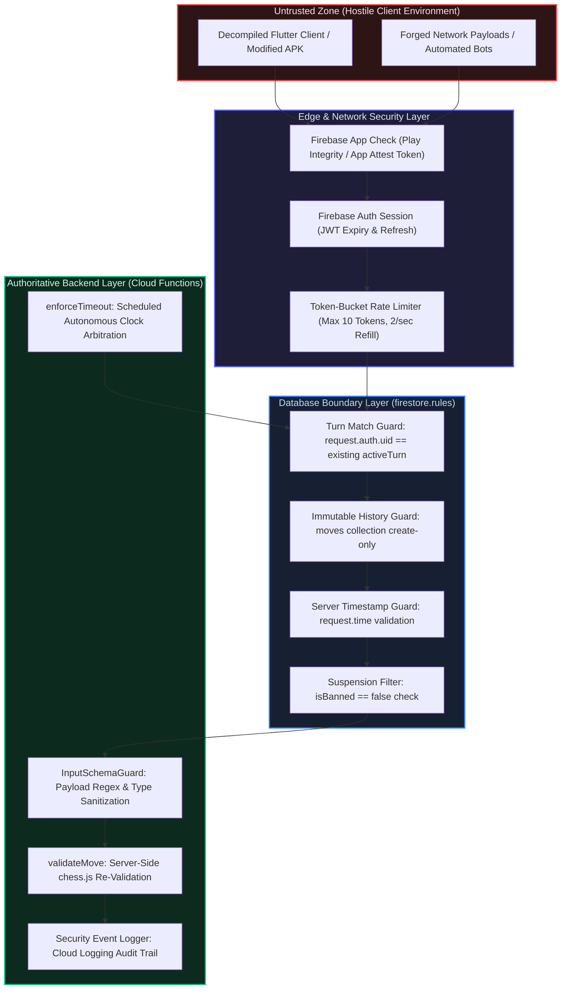

# Chessical // Security Architecture & Threat Model

This document specifies the threat model, zero-trust authorization boundaries, cryptographic replay protection, anti-cheat detection heuristics, and security incident response protocols of the Chessical platform.

> **Zero-Trust Security Principle**: Every client device is assumed to be fully compromised, reverse-engineered, and capable of forging network packets. No client is authoritative for move legality, remaining clock balances, turn assignment, or match outcomes.

---

## Security Invariants Matrix

| Layer | Defense Mechanism | Architectural Invariant |
| :--- | :--- | :--- |
| **App Attestation** | Firebase App Check | Rejects API and Firestore traffic from untrusted binaries (Play Integrity on Android, DeviceCheck/App Attest on iOS). |
| **Participant Identity** | Firebase Auth UID | Caller UID is strictly resolved from `request.auth.uid` / `context.auth.uid`, never from client-supplied request payloads. |
| **Replay Protection** | Cryptographic UUIDv4 | Every move submission includes a unique `clientMoveId`; duplicated tokens are rejected at the transaction boundary. |
| **Rate Limiting** | Token-Bucket Limiter | Maximum 10-token burst capacity with 2-token/sec replenishment per UID in `rateLimiter.ts`. |
| **Write Authorization** | Firestore Security Rules | Move writes are restricted strictly to the UID matching `resource.data.activeTurn` on the existing document. |
| **Clock Tamper-Proofing** | `FieldValue.serverTimestamp()` | Server time deltas compute elapsed time; client-supplied timestamp fields are rejected. |
| **Move Audit Trail** | Create-Only Subcollections | The `/matches/{id}/moves` subcollection allows create operations only; updates and deletions are permanently prohibited. |
| **Authoritative Re-Check** | `validateMove.ts` (Cloud Function) | Server independently re-evaluates move legality via `chess.js` with automated rollback on tampering. |



---

## Table of Contents

- [1. Threat Model & Attack Vectors](#1-threat-model--attack-vectors)
- [2. Token-Bucket Rate Limiter Specification](#2-token-bucket-rate-limiter-specification)
- [3. Cryptographic Idempotency & Replay Guard](#3-cryptographic-idempotency--replay-guard)
- [4. Anti-Cheat & Engine-Assistance Detection](#4-anti-cheat--engine-assistance-detection)
- [5. Input Validation & Schema Guard](#5-input-validation--schema-guard)
- [6. Incident Response & Threat Containment](#6-incident-response--threat-containment)
- [7. Privacy, Data Retention & Right to Erasure](#7-privacy-data-retention--right-to-erasure)

---

## 1. Threat Model & Attack Vectors

| Attack Vector | Threat Level | Target Subsystem | Mitigation Architecture |
| :--- | :--- | :--- | :--- |
| **UID Spoofing** | Critical | Match state writes | Security rules bind writes to `request.auth.uid == resource.data[activeTurn]`. Payload UIDs are ignored. |
| **Move Replay / Race Condition** | High | Move ingestion stream | `clientMoveId` (UUIDv4) is checked inside atomic transaction against `processedClientMoveIds`. |
| **Client Clock Manipulation** | High | Turn clock remaining | Elapsed time computed exclusively from server timestamp deltas ($T_{\text{server}} - T_{\text{last}}$). |
| **Move Flood / Denial of Service**| High | Cloud Functions & Firestore | In-memory token-bucket throttles move submissions to 2/sec with a 10-token burst cap. |
| **Decompiled Client Modification** | Critical | Legal move constraints | Authoritative `validateMove.ts` independently validates all moves on the server via `chess.js`. |
| **Move History Tampering** | Critical | `/moves` subcollection | Rules enforce `allow update, delete: if false;` on all move log documents. |
| **Unauthenticated Rating Farming** | Medium | Matchmaking & Elo | Anonymous accounts must upgrade to authenticated credentials before rated games affect Elo. |

---

## 2. Token-Bucket Rate Limiter Specification

The rate limiter in `functions/src/rateLimiter.ts` implements a deterministic continuous token-bucket algorithm per UID:

$$B(t) = \min\left(C,\; B(t_{\text{last}}) + r \cdot (t - t_{\text{last}})\right)$$

Where:
- $C = 10.0$ (Maximum burst capacity)
- $r = 2.0$ tokens/second (Replenishment rate)
- Cost per move submission $= 1.0$ token

If $B(t) < 1.0$, the request is rejected with HTTP 429 (`resource-exhausted`):

$$\text{RetryAfterSeconds} = \left\lceil \frac{1.0 - B(t)}{r} \right\rceil$$

---

## 3. Cryptographic Idempotency & Replay Guard

To eliminate duplicate moves caused by mobile packet retransmissions:

1. **UUIDv4 Generation**: Client generates `clientMoveId = Uuid.v4()` before touching the network.
2. **Atomic Transaction Verification**: Inside the Firestore transaction:
   $$\text{Assert}\left( \text{clientMoveId} \notin \text{matchData.processedClientMoveIds} \right)$$
3. **Atomic Append**:
   $$\text{matchData.processedClientMoveIds} \leftarrow \text{matchData.processedClientMoveIds} \cup \{\text{clientMoveId}\}$$
4. **Duplicate Rejection**: If the token exists, transaction aborts with `DuplicateMoveException` without state mutation.

---

## 4. Anti-Cheat & Engine-Assistance Detection

### Heuristic Analysis

Chessical monitors move timing distributions across rated human matches:

1. **Move Latency Distribution**: Tracks per-move decision times $t_i$. Statistically anomalous profiles exhibiting near-zero variance ($\sigma_t < 0.15\text{s}$) across complex tactical positions ($>15$ plies) are flagged for audit.
2. **Stockfish Exemption**: Single-player matches against on-device Stockfish are exempt from timing heuristics since instantaneous engine moves are expected.
3. **Sanction Enforcement**: Flagged accounts have `isBanned: true` set on their `users/{uid}` document, immediately locking them out of matchmaking via security rules and Cloud Functions.

---

## 5. Input Validation & Schema Guard

`functions/src/inputSchemaGuard.ts` enforces strict regex contracts before payload ingestion:

```typescript
const SQUARE_REGEX = /^[a-h][1-8]$/;
const UUID_REGEX = /^[0-9a-f]{8}-[0-9a-f]{4}-[0-9a-f]{4}-[0-9a-f]{4}-[0-9a-f]{12}$/i;
const PROMOTION_REGEX = /^[qrbn]$/i;
```

Malformed coordinates, illegal promotion codes, or oversized string payloads trigger immediate rejection with `invalid-argument` status.

---

## 6. Incident Response & Threat Containment

If hostile behavior or abnormal vulnerability probing is detected:

### Step 1: Immediate Account Suspension
```bash
# Set isBanned flag on the offender's profile document via Firebase Admin
firebase firestore:set users/<ATTACKER_UID> '{"isBanned": true}' --merge
```

### Step 2: Audit Trail Inspection
Inspect Cloud Logging for structured security events:
```text
resource.type="cloud_function"
jsonPayload.eventType="SECURITY_MOVE_VALIDATION_FAILURE" OR jsonPayload.eventType="RATE_LIMIT_TRIPPED"
```

### Step 3: Match Invalidation
If a match state was corrupted by a verified exploit, update `status: 'abandoned'` to prevent rating recalculations.

---

## 7. Privacy, Data Retention & Right to Erasure

1. **Collected Data**: User profile data (UID, display name, Elo rating, win/loss/draw totals) and move history records (SAN, FEN, timestamps).
2. **Data Retention**: Move records are retained for match history integrity. Timing analytics are aggregated into statistical summaries.
3. **Right to Erasure (Account Deletion)**: Deleting a Firebase Auth user triggers profile document anonymization (`displayName: "Deleted Player"`, email removed) while preserving game FEN history so opponent statistics remain mathematically accurate.


<!-- Document reviewed and updated: Phase 5 (Liquid Glass UI & Match History Integration) -->
